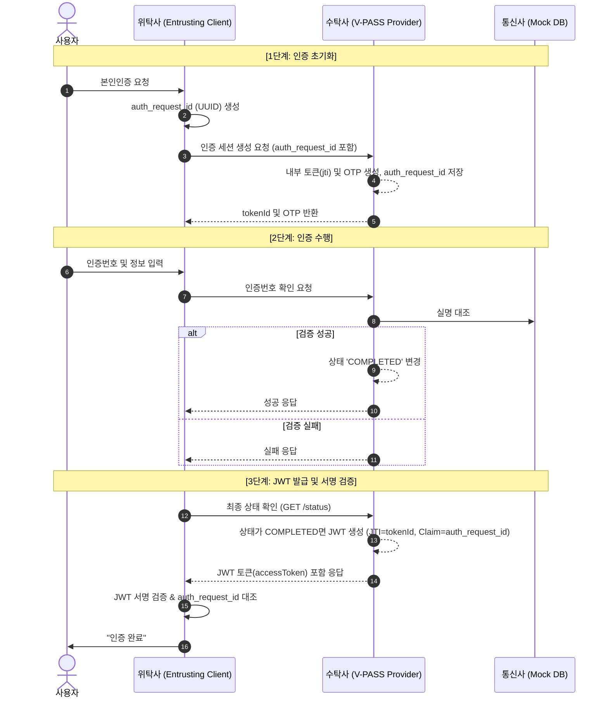

# 본인인증 시스템 인증 흐름 및 구조 설명 (수탁사 & 위탁사)

이 문서는 **수탁사(Trustee, V-PASS Provider)**와 **위탁사(Entruster, Entrusting Client)** 간의 본인인증 처리 흐름과 상호 연관성을 설명합니다.

## 1. 주요 역할 및 용어
- **수탁사 (Trustee/Provider - vpass-provider)**: 본인인증 서비스를 실질적으로 제공하는 주체입니다. 인증번호를 생성하고, 통신사 정보와 대조하여 본인인지 확인합니다.
- **위탁사 (Entruster/Client - entrusting-client)**: 본인인증 서비스를 이용하는 고객사(쇼핑몰, 금융 앱 등)입니다. 수탁사에게 인증을 맡기고 그 결과만 전달받습니다.
- **인증번호 (OTP)**: 수탁사가 생성하며, 사용자의 휴대폰으로 전달되는 6자리 숫자입니다.

## 2. 전체 인증 흐름도 (Sequence Diagram) - JWT Flow

## 3. 핵심 변경 사항 (JWT 적용)

### Q1. JWT는 언제 발급되나요?
인증 절차가 모두 완료되어 상태가 `COMPLETED`가 되었을 때, 수탁사(`AuthService.getAuthStatus`)에서 발급합니다.
이 토큰에는 다음 정보가 포함됩니다:
- **jti (JWT ID)**: 수탁사 내부의 고유 토큰 ID
- **claim (auth_request_id)**: 위탁사가 처음에 보낸 요청 ID (매핑용)

### Q2. 위탁사는 무엇을 검증하나요?
위탁사는 수탁사로부터 받은 JWT의 **서명(Signature)**을 검증하여 위변조 여부를 확인하고, JWT 내부의 `auth_request_id`가 자신이 보낸 것과 일치하는지 확인하여 거래를 확정합니다.

## 4. 구조적 특징
- **Token 방식**: 수탁사는 인증 완료 후 `tokenId`를 통해 상태를 관리하므로, 위탁사는 실제 사용자의 민감 정보를 직접 들고 있지 않아도 인증 여부를 판단할 수 있습니다.
- **보안 강화**: `entrusting-client/backend`의 `UserController`는 수탁사의 API를 호출하여 토큰 상태가 `COMPLETED`인지 반드시 확인한 후에만 후속 절차(회원가입 등)를 진행합니다.
