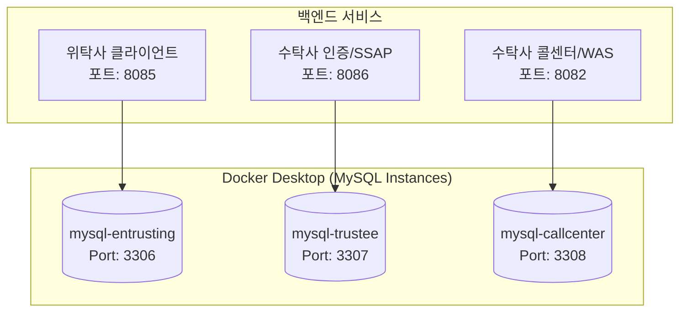

# Continue Bank - 금융 보안 플랫폼

> 금융의 중단 없는 흐름을 기술로 지킵니다.

Continue Bank는 SSAP 본인인증 시스템을 활용한 금융 서비스 플랫폼입니다. 위탁사(Continue Bank), 수탁사(SSAP 본인인증), TM 센터(콜센터) 간의 안전한 개인정보 처리 및 금융 컴플라이언스를 구현합니다.

## 📋 목차

- [프로젝트 개요](#-프로젝트-개요)
- [시스템 아키텍처](#-시스템-아키텍처)
- [주요 기능](#-주요-기능)
- [기술 스택](#-기술-스택)
- [프로젝트 구조](#-프로젝트-구조)
- [시작하기](#-시작하기)
- [서비스별 상세 문서](#-서비스별-상세-문서)

## 🎯 프로젝트 개요

Continue Bank는 금융 보안 컴플라이언스를 준수하는 현대적인 디지털 뱅킹 플랫폼입니다.

### 핵심 가치
- **보안 우선**: 모든 개인정보는 AES-256 암호화로 보호
- **컴플라이언스**: 금융 규정 준수 (9개 필수 약관 + 2개 선택 약관)
- **투명성**: 사용자에게 명확한 데이터 처리 고지
- **신뢰**: SSAP 본인인증을 통한 안전한 신원 확인

## 🏗 시스템 아키텍처



### 데이터 흐름
1. **[위탁사]** 약관 동의 및 정보 입력
2. **[위탁사→수탁사]** V-PASS 본인인증 요청 (tokenId 생성)
3. **[수탁사]** OTP 발송 및 검증 (전용 DB 3307 사용)
4. **[위탁사]** 회원가입 완료 (CI 기반 중복 체크)

---

## ✨ 주요 기능

### 1. 위탁사 (Continue Bank)

#### 사용자 인증
- 회원가입 / 로그인
- 아이디 찾기 / 비밀번호 재설정
- SSAP 본인인증 연동

#### 금융 서비스
- 계좌 개설
- 대시보드
- 거래 내역 조회

#### 컴플라이언스
- 9개 필수 약관 + 2개 선택 약관 관리
- 동의 내역 조회 및 철회
- 본인인증 기록 관리
- 개인정보 처리 요청

### 2. 수탁사 (SSAP 본인인증)

#### 본인인증
- 휴대폰 번호 기반 OTP 인증
- CI (Connecting Information) 생성
- JWT 토큰 발급

#### 보안
- AES-256 암호화 (이름, 휴대폰번호)
- TTL 기반 인증 데이터 자동 삭제 (3분)
- IP 주소 기록

#### 데이터 관리
- 인증 기록 저장
- 가상 통신사 데이터베이스

## 🛠 기술 스택

### Backend
- **Framework**: Spring Boot 3.x
- **Language**: Java 21
- **Database**: MySQL 8.0
- **Security**: Spring Security, JWT, AES-256
- **ORM**: JPA / Hibernate

### 3. Frontend
- **Framework**: React 18
- **Build Tool**: Vite
- **Routing**: React Router v6
- **Styling**: Tailwind CSS (some), Vanilla CSS
- **Icons**: Lucide React

### 4. Infrastructure
- **Database**: MySQL (Port 3306, 3307)
- **Backend Ports**:
  - 위탁사: 8085
  - SSAP: 8086
- **Frontend Ports**:
  - 위탁사: 5175
  - SSAP: 5176

## 📁 프로젝트 구조

```
homepage-project/
├── entrusting-client/    # 위탁사 (Continue Bank)
├── trustee-provider/     # 수탁사 (SSAP 본인인증)
├── docs/                 # 문서 관리 (배포 가이드, 설계서 등)
├── infra/                # 인프라 설정 (Nginx, K8s, 보안키)
├── database/             # DB 관련 스크립트
├── start-all.bat         # 서비스 통합 실행
└── docker-compose.yml    # 전용 MySQL 컨테이너 구성
```

## 🚀 시작하기

### 사전 요구사항
- Java 21+
- Node.js 18+
- MySQL 8.0+
- npm or yarn

### 1. 데이터베이스 설정

```bash
# MySQL 실행 (Port 3306)
mysql -u root -p

# 데이터베이스 생성 및 초기화
source init.sql
```

### 2. 백엔드 실행

```bash
# 위탁사 백엔드
cd entrusting-client/backend
./mvnw spring-boot:run

# SSAP 백엔드
cd trustee-provider/backend
./mvnw spring-boot:run
```

### 3. 프론트엔드 실행

```bash
# 위탁사 프론트엔드 (Port 5175)
cd entrusting-client/frontend
npm install
npm run dev -- --port 5175 --strictPort

# SSAP 프론트엔드 (Port 5176)
cd trustee-provider/frontend
npm install
npm run dev -- --port 5176 --strictPort
```

### 4. 접속

- **위탁사 (Continue Bank)**: http://localhost:5175
- **SSAP 본인인증**: http://localhost:5176

## 📚 서비스별 상세 문서

각 서비스의 상세한 기술 문서는 다음 링크에서 확인하실 수 있습니다:

- [위탁사 (Continue Bank) 문서](./entrusting-client/README.md)
- [수탁사 (SSAP 인증) 문서](./trustee-provider/README.md)
- [시스템 포트 명세서](../system_port_specification.md)
- [데이터베이스 명세서](../docs/DB_SCHEMA.md)
- [개인정보 처리 흐름도](../docs/PRIVACY_FLOW_2026.md)

## 🔐 보안 고려사항

### 개인정보 암호화
- **알고리즘**: AES-256-CBC
- **대상**: 이름, 휴대폰번호
- **키 관리**: 환경 변수로 분리 관리

### 데이터 보관 정책
- **V-PASS 인증 데이터**: 3분 후 자동 삭제 (TTL)
- **사용자 동의 기록**: 법적 증거로 영구 보관
- **본인인증 기록**: 보안 감시 목적으로 보관

### 컴플라이언스
- 금융 규정 준수 (9개 필수 약관)
- GDPR 스타일 개인정보 관리
- 사용자 동의 철회 기능 제공

## 📄 라이선스

이 프로젝트는 교육 목적으로 제작되었습니다.

## 👥 기여자

- **개발**: Continue Bank Development Team
- **디자인**: Toss-style UI/UX 참고

## 📞 문의

프로젝트에 대한 문의사항은 GitHub Issues를 통해 남겨주세요.

---

**Continue Bank** - 금융의 중단 없는 흐름을 기술로 지킵니다. 🏦
