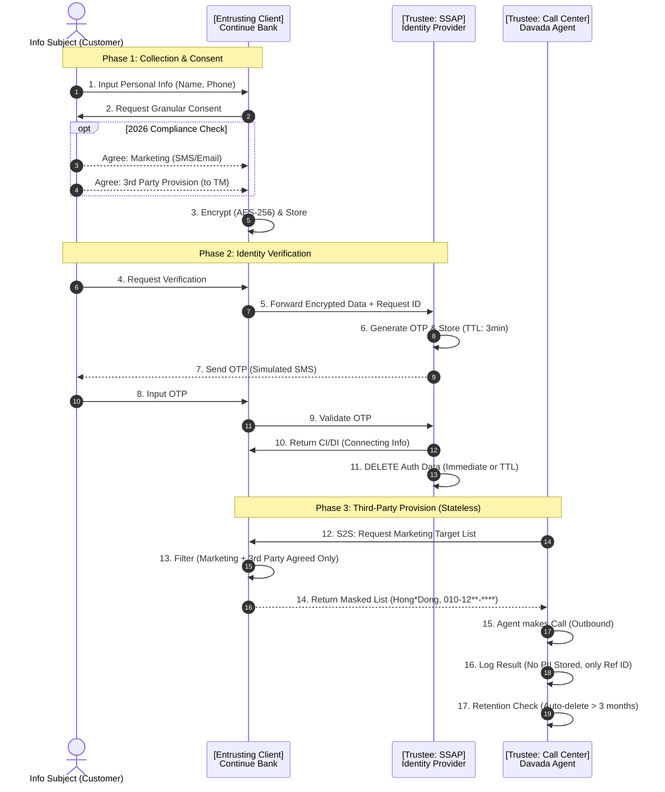

# Personal Information Processing Flow (2026 Compliance)
> "금융의 중단 없는 흐름, 보안은 계속됩니다."

This document details the flow of personal information within the Continue Bank ecosystem, strictly adhering to the **2026 Financial Data Privacy Regulations**.

---

## 📜 Key Compliance Principles (2026 Applied)

| Principle | Implementation in Continue Bank |
| :--- | :--- |
| **Granular Consent** (선택적 동의 세분화) | Marketing consent is split into **SMS, Email, Push**. Third-party provision is **separate** from service usage. |
| **Data Minimization** (데이터 최소화) | Call Center agents view **Masked Data** only. PII is **not stored** in agent databases. |
| **Right to Erasure** (잊혀질 권리 & TTL) | Auth tokens (SSAP) auto-expire in **3 minutes**. Call logs are retained for **3 months** then destroyed. |
| **Right to Explanation** (설명 요구권) | Interfaces explicitly state *why* data is needed before collection ("Verify to protect assets"). |
| **Safety by Design** (설계적 안전) | All PII (Name, Phone) is **AES-256 Encrypted** at rest and in transit (S2S). |

---

## 🔄 Privacy Data Flow Diagram

---

## 🛡️ Technical Implementation Details

### 1. Encryption (AES-256)
All sensitive columns in `site_users` (Entrusting) and `auth_token` (SSAP) are encrypted using `javax.crypto`.
*   **Key**: Managed via Environment Variables (`ENCRYPTION_KEY`).
*   **Scope**: `name`, `phone_number`.

### 2. S2S Communication Security
Communication between Entrusting Client and Call Center/SSAP is protected.
*   **Token**: `X-Service-Token` header required for API access.
*   **IP Whitelist**: APIs only accept requests from known container IPs (simulated via CORS/Service logic).

### 3. Audit Logging (Non-Repudiation)
Every access to PII is logged in the `access_log` table.
*   **Who**: Agent ID / User ID
*   **When**: Timestamp
*   **Why**: Action Code (e.g., `VIEW_360`, `SEARCH_MEMBER`)
*   **Compliance**: Information subjects can view their own access logs via "My Page".

---

## ⚖️ Legal Mapping (Korea Personal Information Protection Act)

*   **Article 15 (Collection/Use)**: Met via `TermsAgreement.jsx` (Essential vs Optional separation).
*   **Article 17 (Provision to Third Party)**: Met via `third_party_provision_agreed` field.
*   **Article 21 (Destruction)**: Met via `RetentionScheduler` (SSAP 3min, Call Logs 3months).
*   **Article 29 (Safety Measures)**: Met via AES-256 Encryption & Access Control.
